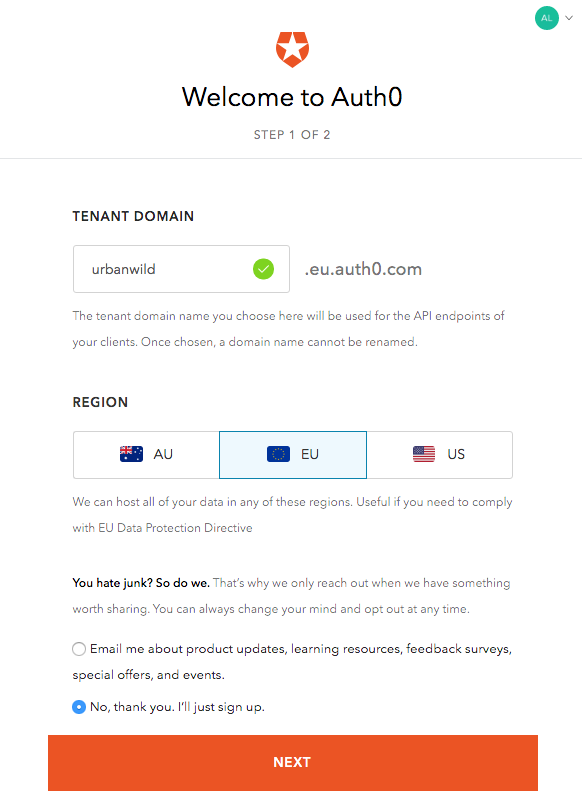
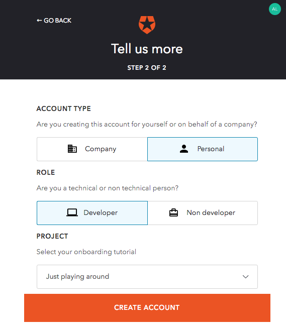

# Adding Authentication [UNDER CONSTRUCTION: NOT FOR PUBLIC USE]

As of release [SPWA Supported]([SPWA Supported](https://github.com/aliceliveprojects/WildLoggingDB/releases/tag/spwa_supported)), the application works as an open data API.

This means that the data we gather is vulnerable to being altered when we would really rather it wasn't!

The SPWA is fairly simple, in that it POSTs new Things, and new Events, and then searches and reads them:

```
GET /things/
GET /things/{id}
POST /things/

GET /events/
GET /events/{id}
POST /events/
```

These following functions are much more in need of protection, since they can delete large amounts of data, or alter existing items.

```
DELETE /things/{id}
PUT /things/{id}

DELETE /events/{id}
PUT /events/{id}
```

We're going to wrap these in an authentication layer, so that access is only granted with a valid token.

## Authentication

If we're going to add authentication to our endpoints, then we need to choose an authentication method which is suitable.

We use a protocol called [OAuth2](https://oauth.net/2/) which is suited to clients such as SPWAs, whose scripts can be seen and altered by end-users with browser tools.

We use a Platform as a Service, called [Auth0](https://auth0.com), which provides us with a generous free tier for prototyping, and handling user accounts.

## The Plan

1. create a new Auth0 account 
2. use the RESTlet UI to add authentication definitions to our REST API definition (the swagger.yaml file)
3. add authentication handlers to the RESTFul service, which map to the authentication definitions
4. use the authentication handlers to intercept incoming REST requests and validate the authentication tokens, encoded in their headers.
5. Implement code which validates the tokens against a service endpoint, provided by Auth0.

# Here we go

## Auth0, the authorisation provider

First things, first; Auth0 is going to help us manage users, and whether they are authenticated to the sensitive parts of the API.  

Auth0 handles user accounts as well as the entire sign-up and login process. We'll be creating our own admin account on Auth0. This will give us a free-tier allowance of 10,000 user accounts. 

Don't forget: when you allow a user to sign-up to your service, you will be liable for the information they give you under [GDPR](https://ico.org.uk/for-organisations/guide-to-data-protection/). Auth0 provides all the tools you need to be GDPR compliant, but you need to be aware of your obligations.  Be aware that anyone signing up to your service has rights on the information that they leave there. A good place to start is simply to switch off the sign-up option which Auth0 presents to new users, and to create accounts only for yourself and your team. We'll be doing this later, but wanted to let know know that first :-)

When our API is used, it's usually via a single page web application (SPWA). 

In our simple demonstration, we'll add authentication to the Swagger UI SPWA; the one which is built for us in the server skeleton.

The Swagger UI allows us to present an authenticated API, by default; it provides the UI elements required to authenticate via an Oauth implicit flow.

When users attempt to authenticate to get access to the API, the Swagger UI will be directed to an Auth0 login page.

The Auth0 page will give the user the option of signing-in, or signing up. Whether this option is given to them or not, is dependent on the configuration in the Auth0 account. The login page can be customised, also.

Once Auth0 has authenticated the user, it sends back a token in a redirect URL. The Swagger UI intercepts the URL, extracts the token and retains it.

Now, when the user uses the Swagger UI to send a request to a particular endpoint exposed by our service, it will send the token in the http header.

On receipt of an http request, our service verifies the token in the header, before it does anything else. If it checks out OK, the service will continue handling it. If not, it will immediately send back a 403 error, which will be shown by the Swagger UI. 

To verify the token our service will check first that it can be correctly decoded. Next, it will check that the information in it is safe. Finally, it will send the information to a special endpoint on Auth0's servers. 

To make this possible, the token is of a particular format: [JWT, or JSON Web Token](https://jwt.io/). JWTs are base64-encoded, so that they can be passed in a http authorization header as a Bearer type. For more information about how they are build, see [here](https://jwt.io/introduction/).

## Create an Auth0 account

Creating an Auth0 account couldn't be simpler: 

1. go to https://auth0.com/ and click on 'Sign-up'. 
2. you'll be presented with a choice of email address + password , or syndiction with Google, Facebook, or Github account. We used the same email address as for our Heroku account earlier.
3. Next, you'll be asked for a 'tenant' domain name. It's used for authentication endpoints. We chose 'urbanwild'.
4. Also, make sure you choose the EU region to host your user account data. 
5. 
6. Finally, we'll let Auth0 know we're not really serious:
7. 

8. That's it! The account is created. You'll need to verify it, by checking the email address you gave to sign-up with.
9. 

 


