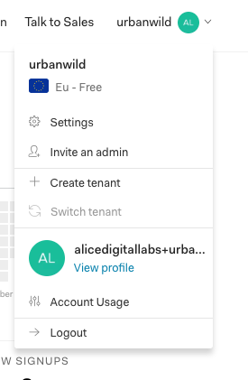

## Enabling Third-Party Authentication

This script takes you through adding **Third-Party authentication** to the API which you have already enabled for First-Party authentication.

First Party Authentication means that we will only grant access to the authenticated parts of the API to a SPWA which has been **served from the same domain as the API**. In this case, that means the **SwaggerUI** you developed in the last script.

Because of Cross-Origin restrictions, the browser **won't support the use of SPWAs served from other domains** (such as GitHub Pages) . 

To do that, we need to enable the Auth0 account, and we need to add some athentication smarts to the SPWA.

In this case, the SPWA we'll be upgrading is **WildLogging**. 

We will add:

* An Admin landing page, which handles login and logout
* A Things page, which handles listing and deleting of Things
* An Events page, which handles listing and deleting of Events

First though, the Account.

In the previouse script we defined an application in the Auth0 account (SwaggerUI) and gave it access to our API. Because we *own* the application, and it's served from our domain, we're happy that it's safe.

In the case of the WildLogging application; that's served to us from GitHub Pages; a different domain. It's untrusted.

You'll find that all API providers, Google, Twitter, Facebook etc. require the Developer of an SPWA to register it, and get a client ID, before they are allowed to access the API.

Once the developer has deployed that SPWA, a user of it must consent to it using the API to access their data.

This is exactly what we will be facilitating by making the API available to third-parties:

1. The developer will register their SPWA with the owner of the API (Urban Wild, on Auth0)
   1. They get a client ID
2. The developer writes the application to access the API on the user's behalf 
   1. The application will present the user with a login process
      1. it gets an access token using Auth0 and the client ID
      2. the application will access the user's data
3. The  developer deploys the app
   1. To GitHub Pages - a different domain to the API and the Authentication
4. The user uses the App to access the service:
   1. They attempt to log-in
   2. Auth0 handles the login
      1. Asks the user to give consent for the app to access their data
      2. Allows them to login and connect the app with their data
5. Notice that 'consent' means that the user is allowing the app to access their important data, on their behalf. 
   1. **They had better be very sure they know this app is safe**
   2. This is the reason for certification (trust certificates) on the browser address bar.

## Auth0 Third Party Authentication

When you set up your account with Auth0, you're given the ability to add applications and APIs to a Tenant. 

In this case, the Tenant is the same as our organisation: Urban Wild. Tenant is a good word: essentially our group of authenticated things called 'Urban Wild' rents space on Auth0's infrastructure.

### Set Auth0 to Allow Dynamic Application Registration

This is the first stage in the process of making the API accessible to third-party developers.

The Urban Wild tenant has some settings which are important. You can find them by logging into your Auth0 account's dashboard, and going into your account profile.

tap on the profile button:

Choose 'Settings'

